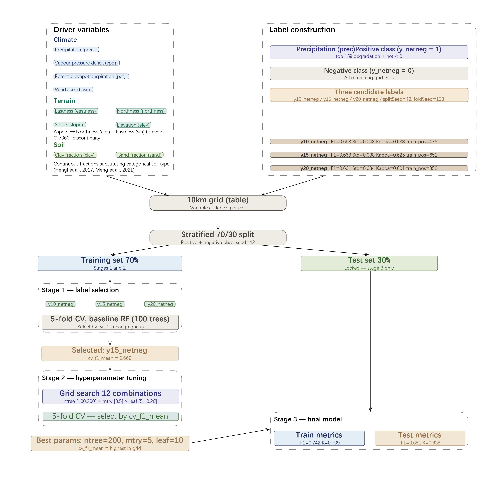

# Project Summary

This application investigates land degradation dynamics in Mongolia's forest-grassland-desert transition zone using Google Earth Engine. By 2016, approximately 72% of Mongolia's land had experienced desertification (Zhang et al., 2022). By comparing Dynamic World V1 land cover composites between two periods (2016–2018 and 2021–2023), we detect degradation and recovery patterns across a 10km grid. A Random Forest classifier trained on climate, terrain, and soil drivers predicts each grid cell's degradation probability, identifying areas at risk before visible change occurs. The tool supports NGOs and environmental monitoring organisations in prioritising intervention across central-southern Mongolia.

## Problem Statement

This application addresses the problem that land degradation in Mongolia’s forest–grassland–desert transition zone is spatially uneven (Meng et al. 2021), but it is often difficult to identify which areas already show strong degradation signals and which areas may become more vulnerable. Change maps alone can show that land cover has changed, but they do not clearly support priority-setting. Our app aims to help users detect degradation hotspots, compare conditions across 10 km grid cells, and identify areas that may need earlier monitoring or intervention.

## End User

This project is designed for organizations involved in land degradation monitoring and dryland management in Mongolia, including the Ministry of Environment and Climate Change and Green Mongolia Hub NGO. Currently, land degradation information often remains aggregated at national scales or presented as static maps, making it difficult to translate into actionable insights. To address this, our interactive GEE application supports decision-making by identifying priority monitoring areas and explaining their underlying risks, shifting from descriptive mapping to decision-oriented analysis.

## Data

```{=html}
<table class="data-table">
  <thead>
    <tr>
      <th>Category</th>
      <th>Dataset</th>
      <th>Description</th>
      <th>Source</th>
    </tr>
  </thead>
  <tbody>
    <tr>
      <td rowspan="7" class="category-cell">GEE</td>
      <td>Dynamic World V1</td>
      <td class="desc-cell">10m land cover classification, composited for 2016–2018 and 2021–2023</td>
      <td><a href="https://developers.google.com/earth-engine/datasets/catalog/GOOGLE_DYNAMICWORLD_V1">Link</a></td>
    </tr>
    <tr>
      <td>FAO GAUL 2015 Level 0</td>
      <td class="desc-cell">Global country boundaries, used to define Mongolia study extent</td>
      <td><a href="https://developers.google.com/earth-engine/datasets/catalog/FAO_GAUL_2015_level0">Link</a></td>
    </tr>
        <tr>
      <td>FAO GAUL 2015 Level 1</td>
      <td class="desc-cell">Mongolia province-level administrative boundaries, used as a reference layer in the interface</td>
      <td><a href="https://developers.google.com/earth-engine/datasets/catalog/FAO_GAUL_2015_level1">Link</a></td>
    </tr>
    <tr>
      <td>TerraClimate</td>
      <td class="desc-cell">Monthly climate data (precipitation, VPD, PET, wind speed), composited for 2016–2018</td>
      <td><a href="https://developers.google.com/earth-engine/datasets/catalog/IDAHO_EPSCOR_TERRACLIMATE">Link</a></td>
    </tr>
    <tr>
      <td>SRTM DEM</td>
      <td class="desc-cell">Elevation, slope, and aspect (decomposed into northness and eastness)</td>
      <td><a href="https://developers.google.com/earth-engine/datasets/catalog/USGS_SRTMGL1_003">Link</a></td>
    </tr>
    <tr>
      <td>OpenLandMap Clay</td>
      <td class="desc-cell">Topsoil clay content (0cm depth), used as soil texture driver</td>
      <td><a href="https://developers.google.com/earth-engine/datasets/catalog/OpenLandMap_SOL_SOL_CLAY-WFRACTION_USDA-3A1A1A_M_v02">Link</a></td>
    </tr>
    <tr>
      <td>OpenLandMap Sand</td>
      <td class="desc-cell">Topsoil sand content (0cm depth), used as soil texture driver</td>
      <td><a href="https://developers.google.com/earth-engine/datasets/catalog/OpenLandMap_SOL_SOL_SAND-WFRACTION_USDA-3A1A1A_M_v02">Link</a></td>
    </tr>
  </tbody>
</table>
```

## Methodology

We first use Dynamic World to identify Mongolia’s forest–grassland–desert transition zone and select a central-southern AOI. We then create land-cover composites for 2016–2018 and 2021–2023 (Lamchin, M. et al. 2016), compare them to detect changed pixels, and classify key transitions into degradation and recovery. These pixel-level results are aggregated into 10 km grid cells, where we calculate change, degradation, recovery, and net change indicators. The grid dataset is then used to identify observed hotspots. Following the driver framework of Meng et al. (2021), climate, terrain, and soil variables are extracted and overlaid onto the same grid to train a Random Forest model (Yulianto, F. et al. 2023), so the app can show both current degradation patterns and areas of higher concern.



## Interface

The interface is designed as a monitoring and screening tool rather than a static map. Users can switch between three main views: Historical Change, Priority Areas, and Susceptibility Map. This structure helps NGOs and environmental monitoring users move from observed evidence to modelled risk interpretation.


To make the tool more interpretable, clicking any 10 km grid cell opens an inspector panel showing observed change indicators, modelled probability, priority status, and environmental drivers. The app also includes guided examples, administrative boundaries, a probability filter slider, and a study-area summary panel, making the interface suitable for both exploration and live demonstration.


# The Application

View application source code [here](https://code.earthengine.google.com/1674eb5eb7633403d6d3ac2644abe7e3).

::: column-page
<iframe src="https://rs-and-bsabd.projects.earthengine.app/view/mongolia-land-degradation-fast" width="100%" height="700px">

</iframe>
:::

# How it Works

## Data Pro-precessing

### Defining the Study Area

A full-country Dynamic World composite was first visualised to identify where forest, grassland, and bare land co-occur. The AOI **\[95°E, 45°N, 115°E, 48°N\]** was selected to capture the grassland-desert ecotone in central-southern Mongolia.

``` javascript
// Load full Mongolia boundary for exploration
var mongolia = ee.FeatureCollection("FAO/GAUL/2015/level0")  
  .filter(ee.Filter.eq('ADM0_NAME', 'Mongolia'));

// AOI defined based on visual inspection
var aoi = ee.Geometry.Rectangle([95, 45, 115, 48]);
```

### Land Cover Compositing

-   Two 3-year mode composites: **2016–2018** (early) and **2021–2023** (recent).
-   **Growing season** only (Jun–Sep) to reduce cloud and snow contamination.
-   mode() selects the most frequent land cover class per pixel.

``` javascript
var dwEarly = ee.ImageCollection("GOOGLE/DYNAMICWORLD/V1")
  .filterDate('2016-06-01', '2018-09-30')
  .filterBounds(aoi)
  .select('label')
  .mode()
  .clip(aoi);

var dwRecent = ee.ImageCollection("GOOGLE/DYNAMICWORLD/V1")
  .filterDate('2021-06-01', '2023-09-30')
  .filterBounds(aoi)
  .select('label')
  .mode()
  .clip(aoi);

// Verify class distribution
print('Class distribution 2016-2018:',
  dwEarly.reduceRegion({
    reducer: ee.Reducer.frequencyHistogram(),
    geometry: aoi, scale: 1000, maxPixels: 1e9
}));
```

### Change Detection & Grid Aggregation

-   Transitions encoded as from × 10 + to (e.g. grass→bare = 27, trees→bare = 17).

-   **Degradation**: grass/trees/shrub → bare.

-   **Recovery**: bare → grass/trees/shrub.

A net change value per 10km grid cell was computed as recovery_mean − degradation_mean, with negative values indicating net degradation.

``` javascript
// Encode transitions
var transition = dwEarly.multiply(10).add(dwRecent) 
  .updateMask(dwEarly.neq(dwRecent));

// Degradation transitions (→ bare land)
var grassToBare = transition.eq(27);   // grass  → bare
var treesToBare = transition.eq(17);   // trees  → bare
var shrubToBare = transition.eq(57);   // shrub  → bare

var degradation = grassToBare
  .add(treesToBare)
  .add(shrubToBare)
  .gt(0)
  .rename('degradation');

// Recovery transitions (bare → vegetation)
var bareToGrass = transition.eq(72);   // bare → grass
var bareToTrees = transition.eq(71);   // bare → trees
var bareToShrub = transition.eq(75);   // bare → shrub

var recovery = bareToGrass
  .add(bareToTrees)
  .add(bareToShrub)
  .gt(0)
  .rename('recovery');

// Aggregate to 10km grid
var gridStats = stackedImage.reduceRegions({ 
  collection: grid, 
  reducer: ee.Reducer.mean() 
    .combine(ee.Reducer.mode(), null, true), 
  scale: 500, 
  crs: 'EPSG:4326' 
});
```

## Data Analysis

### Data Cleaning and Hotspot Preparation

This notebook cleaned the 10 km grid dataset, converted pixel-level change ratios into **whole-grid degradation indicators**, identified **priority hotspot cells**, and exported spatial outputs for later mapping and modelling.

``` javascript
# Keep only valid grid cells with observed change
df_clean = df[df["changed_mean"].notna()].copy()

# Fill missing degradation and recovery values with zero
df_clean["degradation_mean"] = df_clean["degradation_mean"].fillna(0)
df_clean["recovery_mean"] = df_clean["recovery_mean"].fillna(0)

# Build whole-grid degradation, recovery and net-change indicators
df_clean["degradation_share_allpx"] = (
    df_clean["changed_mean"] * df_clean["degradation_mean"]
)
df_clean["recovery_share_allpx"] = (
    df_clean["changed_mean"] * df_clean["recovery_mean"]
)
df_clean["net_change_allpx"] = (
    df_clean["recovery_share_allpx"] - df_clean["degradation_share_allpx"]
)

# Define hotspot thresholds from the distribution of grid-level values
deg_threshold = df_clean["degradation_share_allpx"].quantile(0.95)
net_threshold = df_clean["net_change_allpx"].quantile(0.05)
```

### Net-Negative Hotspot Labels

Net-negative hotspot labels were derived from the original grid metrics by combining degradation percentiles with a **negative net-change** condition.

``` javascript
// Calculate degradation thresholds from all grid cells
var pct = grid.reduceColumns({
  reducer: ee.Reducer.percentile([80, 85, 90]),
  selectors: ['degradation_share_allpx']
});

// Define percentile cut-offs for top 20%, 15%, and 10%
var q80 = ee.Number(pct.get('p80'));
var q85 = ee.Number(pct.get('p85'));
var q90 = ee.Number(pct.get('p90'));

// Assign stricter binary labels:
// a cell is positive only if degradation is high
// and overall net change is negative
var gridLabeledB = grid.map(function(f) {
  var deg = ee.Number(f.get('degradation_share_allpx'));
  var net = ee.Number(f.get('net_change_allpx'));
  var isNetNeg = net.lt(0);

  return f.set({
    y20_netneg: deg.gte(q80).and(isNetNeg).int(),
    y15_netneg: deg.gte(q85).and(isNetNeg).int(),
    y10_netneg: deg.gte(q90).and(isNetNeg).int()
  });
});
```

### Early Driver Extraction for RF

This script combined stricter net-negative labels with early-period climate, terrain and soil drivers, then aggregated all variables to the 10 km grid for Random Forest training. 

``` javascript
// Label each grid cell
var gridLabeled = grid.map(function(f) {
  var deg = ee.Number(f.get('degradation_share_allpx'));
  var net = ee.Number(f.get('net_change_allpx'));
  var isNetNeg = net.lt(0);

  return f.set({
    y20_netneg: deg.gte(q80).and(isNetNeg).int(),
    y15_netneg: deg.gte(q85).and(isNetNeg).int(),
    y10_netneg: deg.gte(q90).and(isNetNeg).int()
  });
});
// Climate
var tc = ee.ImageCollection('IDAHO_EPSCOR/TERRACLIMATE')
  .filterDate('2016-06-01', '2018-09-30')
  .filterBounds(aoi);

var prec = tc.select('pr').mean().clip(aoi).rename('prec');
var vpd  = tc.select('vpd').mean().multiply(0.01).clip(aoi).rename('vpd');
var pet  = tc.select('pet').mean().multiply(0.1).clip(aoi).rename('pet');
var ws   = tc.select('vs').mean().multiply(0.01).clip(aoi).rename('ws');

// Terrain: SRTM DEM + derivatives
var dem = ee.Image('USGS/SRTMGL1_003').clip(aoi);
var elev = dem.rename('elev');
var slope = ee.Terrain.slope(dem).rename('slope');
var aspectRad = ee.Terrain.aspect(dem).multiply(Math.PI).divide(180);
var northness = aspectRad.cos().rename('northness');
var eastness = aspectRad.sin().rename('eastness');

// Soil: OpenLandMap surface layer 
var clay = ee.Image('OpenLandMap/SOL/SOL_CLAY-WFRACTION_USDA-3A1A1A_M/v02')
  .select('b0')
  .clip(aoi)
  .rename('clay');

var sand = ee.Image('OpenLandMap/SOL/SOL_SAND-WFRACTION_USDA-3A1A1A_M/v02')
  .select('b0')
  .clip(aoi)
  .rename('sand');

var driverStack = prec.addBands(vpd).addBands(pet).addBands(ws)
  .addBands(elev).addBands(slope)
  .addBands(northness).addBands(eastness)
  .addBands(clay).addBands(sand);

var gridFinal = driverStack.reduceRegions({
  collection: gridLabeled,
  reducer: ee.Reducer.mean(),
  scale: 500,
  crs: 'EPSG:4326'
});
```

### Random Forest Selection and Prediction

A Random Forest model was used to estimate degradation risk for each 10 km grid cell. The model was first tested and tuned using cross-validation, then checked on a separate test set before being applied across Mongolia.

``` javascript
// RF WORKFLOW FOR GEE (SINGLE VERSION)
// Input: 10km grid with degradation labels and driver variables
var grid = table;

// Driver variables grouped by category
var climateBands = ['prec', 'vpd', 'pet', 'ws'];
var terrainBands = ['elev', 'slope', 'northness', 'eastness'];
var soilBands    = ['clay', 'sand'];
var inputBands   = climateBands.concat(terrainBands).concat(soilBands);

// Fixed seed for reproducibility
var splitSeed = 42;

// Best label and hyperparameters selected via 5-fold cross-validation in full workflow
var selectedLabel = 'y15_netneg';  // top 15% degradation + net negative change
var bestNtree     = 200;
var bestMtry      = 5;
var bestLeaf      = 10;

// Split grid into 70% training and 30% test by positive/negative class
function makeSplit(labelName) {
  var pos = grid.filter(ee.Filter.eq(labelName, 1)).randomColumn('rand_split', splitSeed);
  var neg = grid.filter(ee.Filter.eq(labelName, 0)).randomColumn('rand_split', splitSeed);
  return {
    trainSet: pos.filter(ee.Filter.lt('rand_split', 0.70)).merge(neg.filter(ee.Filter.lt('rand_split', 0.70))),
    testSet:  pos.filter(ee.Filter.gte('rand_split', 0.70)).merge(neg.filter(ee.Filter.gte('rand_split', 0.70)))
  };
}

var split = makeSplit(selectedLabel);

// Train final model on full training set using best hyperparameters
var finalClassifier = ee.Classifier.smileRandomForest({
  numberOfTrees: bestNtree,
  variablesPerSplit: bestMtry,
  minLeafPopulation: bestLeaf
}).train({
  features: split.trainSet,
  classProperty: selectedLabel,
  inputProperties: inputBands
});

// Switch to probability output mode for risk mapping
var probClassifier = finalClassifier.setOutputMode('PROBABILITY');
var gridProb = grid.classify(probClassifier);

Map.centerObject(grid, 6);

// Assign fill colour based on probability quintiles
var gridProbStyled = gridProb.map(function(f) {
  var p = ee.Number(f.get('classification'));
  return f.set('style', {
    color: '00000000',
    fillColor: ee.Algorithms.If(p.lt(0.2), '00ff0033',
      ee.Algorithms.If(p.lt(0.4), 'ccff0033',
        ee.Algorithms.If(p.lt(0.6), 'ffaa0033',
          ee.Algorithms.If(p.lt(0.8), 'ff550033', 'ff000055')))),
    width: 1
  });
});

// Display degradation risk probability map across Mongolia
Map.addLayer(gridProbStyled.style({styleProperty: 'style'}), {}, 'Grid probability (y15 final)');
```

## Interactive Visualization

### Transect Overview

At launch, the application offers three view modes: Historical Change, Priority Areas, and Susceptibility Map.

###### Historical Change

A dropdown offers six layers covering observed degradation, recovery, net change, and land cover at two time periods. A **side-by-side swipe** compares land cover between 2016–2018 and 2021–2023.

``` javascript
// Swipe comparison: two linked maps with a draggable divider
var leftMap = ui.Map();
var rightMap = ui.Map();

// Linker keeps pan/zoom synchronised across both sides
var swipeLinker = ui.Map.Linker([leftMap, rightMap]);

// SplitPanel with wipe:true provides the draggable divider
var swipePanel = ui.SplitPanel({
  firstPanel: leftMap,
  secondPanel: rightMap,
  wipe: true,
  style: {stretch: 'both'}
});

// Populate left with 2016-18 composite, right with 2021-23
leftMap.layers().add(layerLulcEarly());
rightMap.layers().add(layerLulcRecent());
```

###### Priority Areas

Grid cells in the **top 15%** by degradation share and with negative net change are flagged for monitoring.

###### Susceptibility Map

The Random Forest model outputs a continuous probability (0–1), visualised on a 5-step color ramp. A **threshold slider** filters the map to cells above a chosen probability.

``` javascript
// Server-side filter driven by a client-side slider
function layerRFProbability() {
  var filtered = grid.filter(
    ee.Filter.gte(CONFIG.fieldRFProb, STATE.rfThreshold)
  );
  var styled = filtered.map(function(f) {
    var v = ee.Number(f.get(CONFIG.fieldRFProb));
    return f.set('style', {
      fillColor: paletteFill(v, 0, 1, CONFIG.palRFProb),
      width: 0
    });
  });
  return ui.Map.Layer(styled.style({styleProperty: 'style'}));
}

// Slider widget: each change re-renders the filtered layer
var rfThresholdSlider = ui.Slider({
  min: 0, max: 1, value: 0, step: 0.05,
  onChange: function(v) {
    STATE.rfThreshold = v;
    setActiveLayer();  // re-runs the filter with new threshold
  }
});
```

### Grid Inspector

Works across all three view modes. Clicking any grid cell opens a side panel with its full data, linking map-level patterns with cell-level diagnostics.

``` javascript
// Click anywhere on the map to inspect the underlying grid cell
mapPanel.onClick(function(coords) {
  var point = ee.Geometry.Point([coords.lon, coords.lat]);
  var cell = grid.filterBounds(point).first();
  
  // evaluate() pulls the server-side Feature to the client asynchronously
  cell.evaluate(function(f) {
    if (!f) return;
    renderInspector(f.properties);  // show observed, modelled, drivers
  });
});
```

### Guided Examples

This section provides three one-click examples: **an observed priority area, a high modelled probability cell, and a mixed or recovering cell** that help users quickly learn how to interpret the provided data.

``` javascript
// Pick one representative example grid cell for the guided demo.
// The examples are restricted to Mongolia so that the app does not
// accidentally select cells outside the country but still inside the AOI rectangle.
function getExampleFeature(kind) {
  var gridInMongolia = grid.filterBounds(mongoliaBoundary.geometry());

  // Example 1: an observed priority area.
  // We choose the priority cell with the highest observed degradation share.
  if (kind === 'priority') {
    return gridInMongolia
      .filter(ee.Filter.eq(CONFIG.fieldPriority, 1))
      .sort(CONFIG.fieldDegShare, false)
      .first();
  }

  // Example 2: a high modelled-risk cell.
  // We choose the cell with the highest Random Forest probability.
  if (kind === 'model') {
    return gridInMongolia
      .sort(CONFIG.fieldRFProb, false)
      .first();
  }

  // Example 3: a recovering or mixed-change cell.
  // We choose a cell with positive net change and high recovery share.
  // This gives users a contrast case, not just degradation examples.
  if (kind === 'recovery') {
    return gridInMongolia
      .filter(ee.Filter.gt(CONFIG.fieldNetChange, 0))
      .filter(ee.Filter.gt(CONFIG.fieldRecShare, 0))
      .sort(CONFIG.fieldRecShare, false)
      .first();
  }
}


// Jump to the selected guided example.
// This function changes the map view, highlights the selected grid cell,
// opens the inspector, and shows the short explanation callout.
function goToExample(kind) {
  var exampleName;
  var targetView;
  var targetLayer;

  // Set the map mode and layer depending on which example the user clicked.
  if (kind === 'priority') {
    exampleName = 'Observed priority area';
    targetView = 'B';       // Priority Areas view
    targetLayer = 'net';
  } else if (kind === 'model') {
    exampleName = 'High modelled probability';
    targetView = 'D';       // Susceptibility Map view
    targetLayer = 'net';
  } else {
    exampleName = 'Mixed / recovering cell';
    targetView = 'A';       // Historical Change view
    targetLayer = 'rec';    // Recovery share layer
  }

  // Get the selected example cell from Earth Engine.
  var exampleFeature = ee.Feature(getExampleFeature(kind));

  // Use the centroid so the map can zoom to the middle of the grid cell.
  var centroid = exampleFeature.geometry().centroid(1);
  var coords = centroid.coordinates();

  // Bring the server-side feature data to the client side,
  // so we can use its properties in the inspector and callout.
  exampleFeature.evaluate(function(featureResult) {

    // Bring the centroid coordinates to the client side for map centering.
    coords.evaluate(function(coordResult) {
      var lon = coordResult[0];
      var lat = coordResult[1];

      // Update the app state so the right layer and highlight are shown.
      STATE.viewMode = targetView;
      STATE.activeSubLayer = targetLayer;
      STATE.exampleFeature = exampleFeature;
      STATE.exampleName = exampleName;
      STATE.exampleKind = kind;

      // Highlight the most relevant metric in the inspector.
      if (kind === 'priority') {
        STATE.highlightMetric = CONFIG.fieldDegShare;
      } else if (kind === 'model') {
        STATE.highlightMetric = CONFIG.fieldRFProb;
      } else {
        STATE.highlightMetric = CONFIG.fieldRecShare;
      }

      // Refresh the app layout and visible map layer.
      setAppLayout();
      setActiveLayer();

      // Zoom to the selected example cell.
      mapPanel.setCenter(lon, lat, 9);

      // Open the inspector and the explanation box for this example.
      renderInspector(featureResult.properties, null);
      renderExampleCallout(kind, featureResult.properties);
    });
  });
}
```

## Insights and Objectives

The app supports NGOs and environmental monitoring organisations working on land degradation in Mongolia:

-   **Priority Screening**: Flags the top 15% of grid cells by observed degradation with negative net change, helping target limited budgets.

-   **Risk Forecasting**: The Random Forest susceptibility map surfaces cells with priority-like climate, terrain, and soil conditions that have not yet shown strong change.

-   **Transparent Diagnostics**: The grid inspector and probability slider reveal the drivers behind each flag, avoiding a black-box output.

## Limitations

-   **Data Quality**: Dynamic World V1 relies on Sentinel-2 imagery, which is vulnerable to cloud contamination. Growing-season compositing reduces noise but classification errors may persist.

<!-- -->

-   **Coarse Spatial Resolution**: Aggregating pixel-level change to 10 km grid cells may obscure localised degradation hotspots, limiting the precision available for fine-grained intervention planning.

<!-- -->

-   **Missing Human Pressure**: The model omits key socio-ecological drivers such as livestock density and grazing intensity, so it reflects environmental background conditions rather than the full picture of Mongolian rangeland degradation.

# References

-   Zhang, Y., Wang, J., Wang, Y., Ochir, A., & Togtokh, C. (2022). Land Cover Change Analysis to Assess Sustainability of Development in the Mongolian Plateau over 30 Years. Sustainability, 14(10), 6129. https://doi.org/10.3390/su14106129

-   Meng, X., Gao, X., Li, S., Li, S. and Lei, J., 2021. Monitoring desertification in Mongolia based on Landsat images and Google Earth Engine from 1990 to 2020. Ecological indicators, 129, p.107908.

-   Lamchin, M. et al. (2016). Assessment of land cover change and desertification using remote sensing technology in a local region of Mongolia. https://doi.org/10.1016/j.asr.2015.10.006.

-   Hengl, T., Mendes de Jesus, J., Heuvelink, G.B., Ruiperez Gonzalez, M., Kilibarda, M., Blagotić, A., Shangguan, W., Wright, M.N., Geng, X., Bauer-Marschallinger, B. and Guevara, M.A., 2017. SoilGrids250m: Global gridded soil information based on machine learning. PLoS one, 12(2), p.e0169748.

<!-- -->

-   Yulianto, Fajar & Raharjo, Puguh & Pramono, Irfan & Setiawan, Muhammad & Chulafak, Galdita & Nugroho, Gatot & Sakti, Anjar & Nugroho, Sapto & Budhiman, Syarif. (2023). Prediction and mapping of land degradation in the Batanghari watershed, Sumatra, Indonesia: utilizing multi-source geospatial data and machine learning modeling techniques. Modeling Earth Systems and Environment. 9. 10.1007/s40808-023-01761-y.
